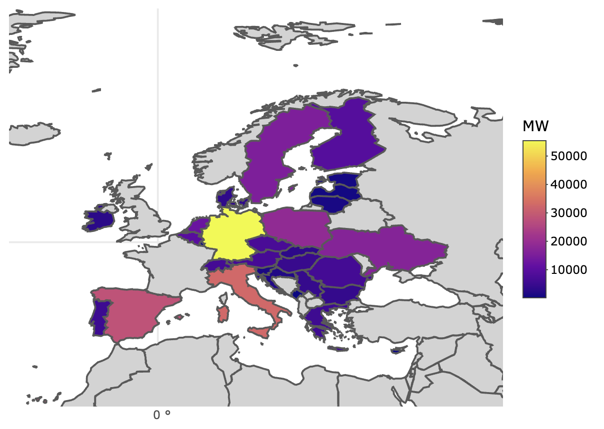
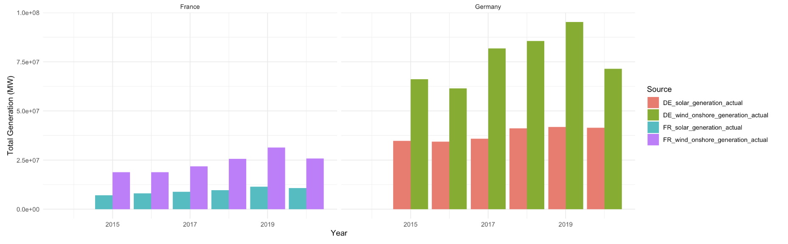
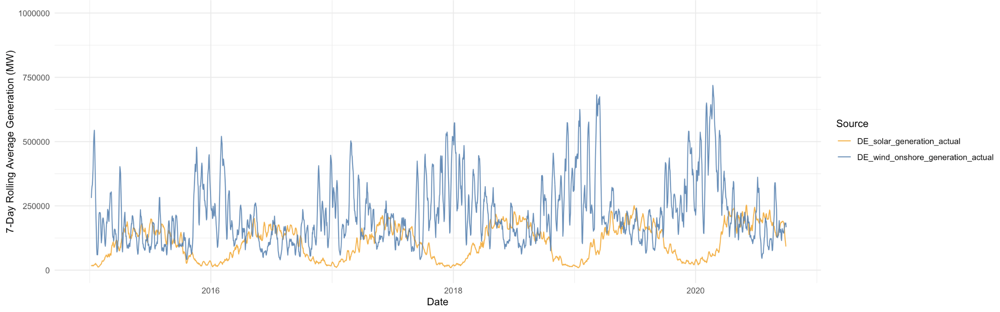
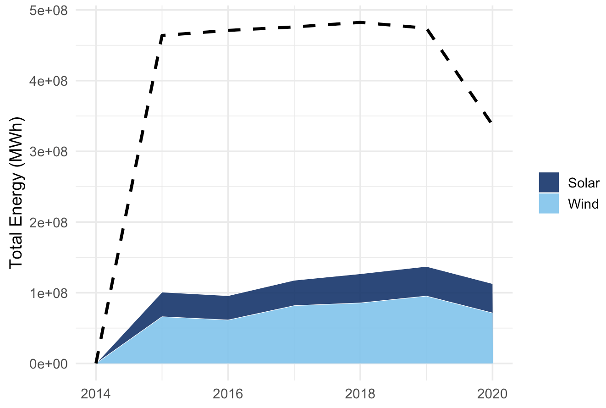
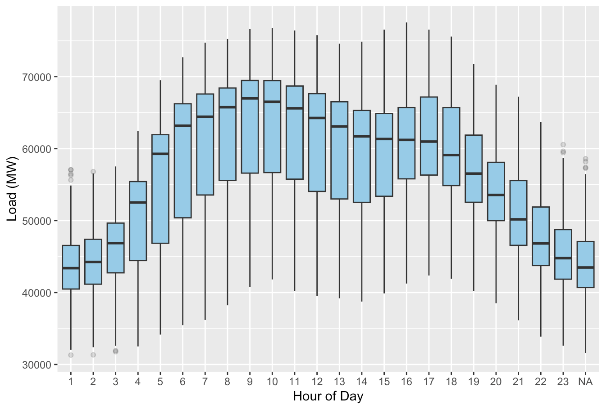
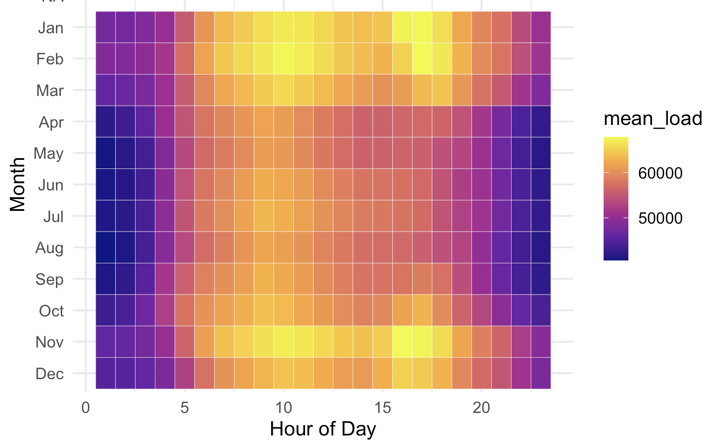
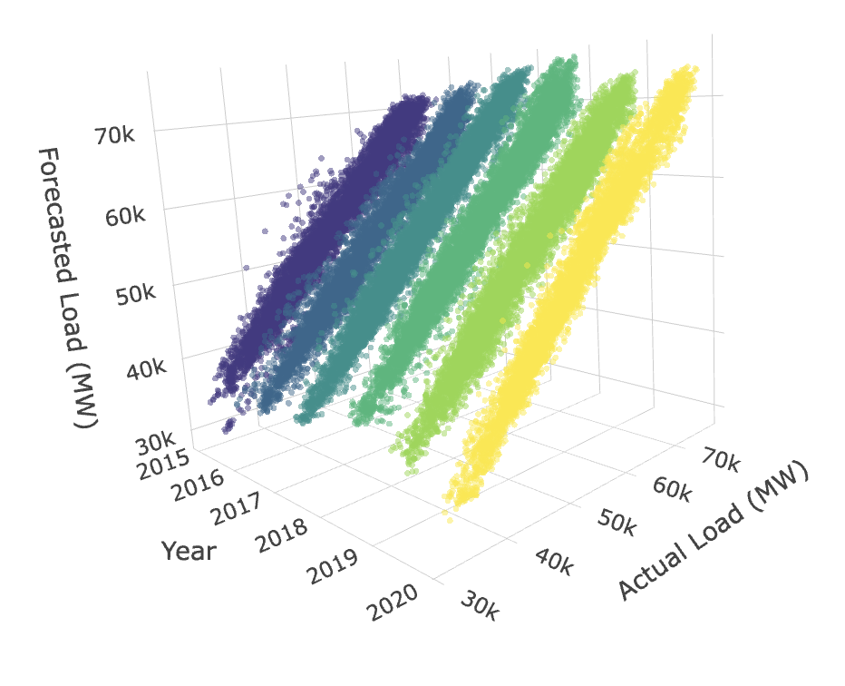
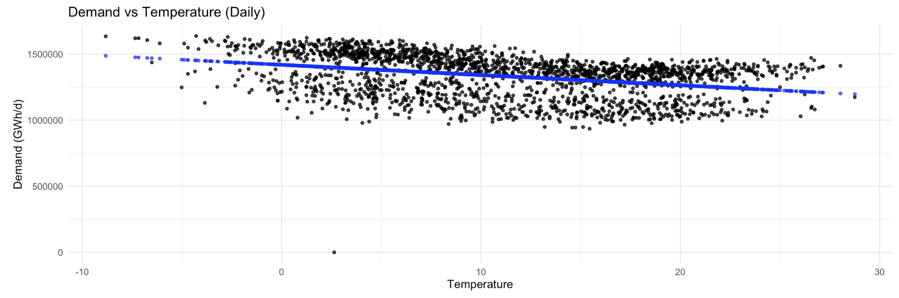

# Energy Trends Germany: Visualization & Analysis (2014–2020)

This project investigates the relationship between electricity consumption, renewable energy generation, and weather conditions in Germany between 2014 and 2020.

By combining hourly datasets from **ENTSO-E** (European electricity data) and **DWD** (German weather data), the analysis explores:

- Temporal and seasonal trends in electricity demand

- Growth of solar and wind generation over time

- Forecast accuracy of electricity loads

- Correlation between temperature and consumption behavior

The project uses R for data cleaning, preprocessing, and visualization — featuring interactive plots (plotly), geospatial maps (sf, rnaturalearth), and time-series analyses (slider, lubridate).

The results highlight Germany’s progress in renewable integration, daily and seasonal demand cycles, and the influence of weather on national electricity usage.

---

## 📊 Data Sources
This project uses publicly available datasets from two main sources:

1. **[ENTSO-E (European Network of Transmission System Operators for Electricity)](https://data.open-power-system-data.org/time_series/)**  
   Provides hourly electricity consumption, generation, and forecast data across European countries.  
   - Variables used: actual load, forecasted load, solar generation, wind generation (Germany and France).

- **[DWD (Deutscher Wetterdienst)](https://opendata.dwd.de/climate_environment/CDC/observations_germany/climate/hourly/)** – Hourly temperature data for major German cities.

---
## 🧼 Data Preprocessing

To ensure clean, comparable time series across sources, we applied the following steps:

1. **Time alignment**
   - Parsed timestamps (`lubridate`) and standardized to **UTC**.
   - Harmonized granularities to **hourly** and aligned ENTSO-E (UTC) with DWD (local → UTC).

2. **Weather data cleaning (DWD)**
   - Treated **missing sentinel values** (`-999`) in temperature as NA.
   - Filtered to validated measurements (**`QN_9 == 3`** where applicable).
   - Selected five major cities (**Berlin, Frankfurt, Munich, Cologne, Hamburg**) and computed a **national hourly mean temperature**.

3. **Electricity data cleaning (ENTSO-E)**
   - Selected Germany (DE) and France (FR) series for: **actual load**, **forecasted load**, **solar generation**, **wind generation**.
   - Imputed occasional gaps with **variable-wise mean imputation** (short, sparse missingness), preserving series continuity for rolling stats.

4. **Feature engineering**
   - Extracted **year, month, day, hour**, and created **7-day rolling averages** (`slider`) for solar and wind.
   - Derived daily aggregates (e.g., **GWh/day** for temperature–demand analysis).

5. **Merging & consistency checks**
   - Joined electricity and weather tables on the **hourly timestamp**.
   - Ran sanity checks for duplicate timestamps, monotonic time, and post-join completeness.

> 🔎 Note: Mean imputation was chosen due to low missingness and to maintain continuity for visualization. For modeling, consider time-aware methods (e.g., Kalman smoothing, seasonal decomposition, or KNN imputation).

---

## 🧰 Tools & Libraries
This project was implemented entirely in **R**, using the following key packages for data wrangling, visualization, and spatial analysis:

| Category | Packages | Purpose |
|-----------|-----------|----------|
| **Data Wrangling & Manipulation** | `tidyverse`, `lubridate`, `slider` | Data cleaning, transformation, and time-based feature extraction |
| **Visualization** | `ggplot2`, `plotly`, `viridis` | Static and interactive plots, color scaling |
| **Geospatial Mapping** | `sf`, `rnaturalearth` | Handling and visualizing spatial data, country borders |
| **Data I/O & Reproducibility** | `readr`, `knitr`, `rmarkdown` | Reading data, rendering reports, and ensuring reproducibility |

All analyses and visualizations were created in an **R Markdown** environment, allowing reproducible workflows and seamless integration of text, code, and figures.

---

## 📈 Analysis Overview
The analysis explores electricity demand, renewable generation, and weather interactions in Germany (2014–2020).  
Key visualizations include:

---

### 1. 🗺️ **Average Electricity Load by Country**

This choropleth map visualizes the **average electricity demand (in megawatts)** across European countries between **2014 and 2020**.  
Brighter colors represent higher average loads, while darker shades indicate lower demand.

- **Germany** shows the highest consumption, exceeding 50,000 MW — reflecting its large industrial base and population.  
- **France, Italy, and Spain** also display high demand, consistent with their economic scale.  
- **Eastern and Nordic countries** exhibit lower average loads, likely due to smaller populations or greater energy efficiency.  

➡️ The map highlights Germany’s central role as a major energy consumer in Europe, motivating deeper national-level analysis in later sections.

---

### 2. 🌞 **Solar & Wind Generation Trends**

This line chart compares **annual renewable electricity generation** from **solar** and **onshore wind** sources in **Germany** and **France** between **2014 and 2020**.

- **Germany** leads in renewable generation, with wind energy contributing the largest share and showing strong growth until 2019.  
- **Solar power** in Germany also shows steady, consistent expansion each year.  
- **France** demonstrates moderate increases in both wind and solar, but at a lower overall scale.  
- The slight dip in **2020** likely reflects **weather variations or pandemic-related impacts** on energy production.  

➡️ This comparison highlights Germany’s sustained investment in renewable capacity and its significant lead over neighboring countries in clean energy generation.

---

### 3. 📅 **Weekly Renewable Output**

This line chart illustrates **weekly renewable electricity generation** in **Germany** from **2014 to 2020**, showing the **7-day rolling averages** for solar and onshore wind output.  
By smoothing daily fluctuations, the visualization highlights long-term and seasonal production patterns.

- **Solar generation** follows a highly predictable seasonal cycle, peaking in **summer** and dropping near zero during **winter months**.  
- **Wind generation** is more variable and irregular, with stronger output during **autumn and winter**.  
- The combination of both sources helps balance the renewable supply across the year — solar dominates in summer, wind in winter.  
- Increasing variability and peak levels toward the later years suggest **expanded wind capacity** and **improved energy capture efficiency**.  

➡️ This rolling-average view clearly demonstrates how solar and wind complement each other seasonally, supporting a more stable renewable energy mix in Germany.

---

### 4. ⚡ **Renewable Energy vs Total Electricity Consumption**

This stacked area chart compares **Germany’s annual renewable electricity generation** (solar and wind combined) with the country’s **total electricity consumption** between **2014 and 2020**.  
The black dashed line represents overall consumption, while the colored areas show the contribution from each renewable source.

- **Wind energy** contributes the majority of renewable generation, showing a strong upward trend until 2019.  
- **Solar energy** grows steadily each year, though on a smaller scale compared to wind.  
- **Total consumption** remains relatively stable, with a noticeable dip in **2020**, likely linked to the **COVID-19 pandemic**.  
- Despite growth in renewables, their combined output still falls short of total demand, revealing the continued need for complementary energy sources and storage solutions.  

➡️ This comparison underscores Germany’s progress in scaling renewables while highlighting the ongoing challenge of meeting national electricity demand solely through clean energy generation.

---

### 5. 🕓 **Hourly & Monthly Demand Patterns**

#### Hourly Trends

Electricity demand rises sharply from **5:00 AM**, peaking between **8:00 AM and 2:00 PM**, reflecting industrial and commercial activity.  
Usage gradually declines in the evening and reaches its lowest levels between **midnight and 5:00 AM**.

#### Monthly Trends

Demand is highest in **winter months** (January, November, December) — driven by heating and lighting needs — and lowest during **summer** (June–August) when daylight is longer and heating is minimal.  
Midday peaks are more pronounced in colder months, showing strong seasonality in electricity usage.

➡️ These temporal patterns reveal how human activity and seasonal factors jointly shape Germany’s electricity demand profile — insights essential for load forecasting and energy planning.

---

### 6. 📉 **Forecast Accuracy – Actual vs Forecasted Load**

This scatter plot compares the **forecasted** and **actual hourly electricity load** in **Germany** from **2014 to 2020**.  
Each point represents one hourly observation, and the black dashed line marks the ideal 1:1 relationship where predictions would perfectly match actual demand.

- Most data points cluster tightly around the diagonal, indicating **high forecasting accuracy**.  
- Deviations become slightly larger at extreme demand levels, suggesting **minor model errors** during unusual conditions.  
- No strong bias toward over- or underestimation is visible — forecasts are **statistically balanced and reliable**.  
- The close alignment between predicted and observed loads reflects **robust forecasting models** and **stable demand patterns**.  

➡️ Overall, these results confirm that ENTSO-E’s forecasting models effectively capture Germany’s electricity demand dynamics, supporting grid stability and energy planning.

---

### 7. 🌡️ **Temperature–Demand Relationship**

This scatter plot examines the **relationship between daily average temperature (°C)** and **total electricity demand (GWh/day)** in **Germany** from **2014 to 2020**.  
Each point represents a single day, with the blue line showing a fitted linear regression trend.

- The visualization shows a **clear negative correlation** — electricity demand increases as temperatures drop.  
- **Cold days (below 10°C)** are associated with **higher electricity usage**, reflecting heating and lighting needs during winter.  
- **Warm days (above 15°C)** correspond to **lower demand**, as less energy is required for heating.  
- Occasional outliers at moderate temperatures suggest **special conditions** such as holidays, industrial peaks, or data anomalies.  
- The downward-sloping trend confirms the **inverse relationship** between temperature and electricity demand across all seasons.  

➡️ This analysis highlights how **weather directly influences energy consumption**, emphasizing the importance of incorporating meteorological factors into demand forecasting and energy management strategies.

 
---
➡️ For full plots and code, see [`final_report_visualization.Rmd`](reports/Project_Markdown.Rmd) or [the report PDF](reports/final_report_visualzation.pdf).

---

**Authors:** Shadi Farzankia, Mina Aminpour, Zoha Karimzadeh  
**Institution:** Berliner Hochschule für Technik (BHT), 2025  
**License:** MIT License 

